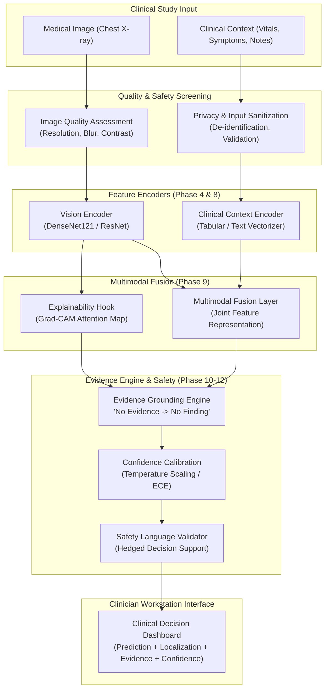

# MedVision AI — System Architecture Specification

## 1. Executive Summary

MedVision AI is an evidence-grounded multimodal medical AI decision-support platform designed to assist clinicians in reviewing chest radiographs alongside clinical context.

> **Status Notice:** The model and dataset have not yet been integrated. This document defines the Phase 1 architectural blueprint and operational constraints.

---

## 2. Core Architectural Principles

### 2.1 Core Principle
> **Prediction + Localization + Evidence + Confidence**

Every finding communicated to a clinician must supply:
1. **Prediction**: The candidate abnormality identified.
2. **Localization**: The model attention region within the radiograph.
3. **Evidence**: Traceable radiological and clinical evidence tokens.
4. **Confidence**: Calibrated model confidence categorized into transparent tiers (High / Moderate / Low).

### 2.2 Critical Safety Rule
> **No evidence → no asserted finding.**

A candidate finding is rejected if neither imaging evidence nor clinical context supports it. Unsupported hypotheses are never presented as established clinical findings.

---

## 3. Component Architecture

### 3.1 Core API (`app/api/`)
* **Framework**: FastAPI with asynchronous endpoints.
* **Endpoints**:
  * `GET /health`: Liveness and integration status.
  * `GET /api/v1/model/info`: Model metadata, architecture, and evaluation status.
  * `POST /api/v1/quality-check`: Image quality screening.
  * `POST /api/v1/analyze`: Multi-modal decision support pipeline.

### 3.2 Feature Encoders (`app/models/`)
* **Vision Model (`VisionModel`)**: Deep convolutional neural network (DenseNet121 backbone) trained for multi-label chest pathology classification.
* **Clinical Text Model (`ClinicalTextModel`)**: Structured symptom and demographic encoder preserving missingness without negative imputation bias.
* **Multimodal Fusion (`FusionModel`)**: Joint projection layer combining visual embeddings and clinical feature vectors.

### 3.3 Explainability Engine (`app/explainability/`)
* **Grad-CAM Explainer (`GradCAMExplainer`)**: Generates gradient-weighted class activation maps targeting the final dense block.
* **Regional Mapper (`AttentionRegionMapper`)**: Maps attention coordinates to standard anatomical lung zones.
* **Terminology Strictness**: Heatmaps are labeled strictly as *"AI model attention regions"*, never as *"lesion segmentations"*.

### 3.4 Evidence Engine (`app/reasoning/`)
* **Evidence Validation (`EvidenceEngine`)**: Synthesizes visual and clinical evidence.
* **Confidence Calibrator (`ConfidenceCalibrator`)**: Re-calibrates raw logits using temperature scaling.
* **Safety Validator (`SafetyValidator`)**: Enforces non-definitive, hedged decision-support language and injects the mandatory clinical disclaimer.
